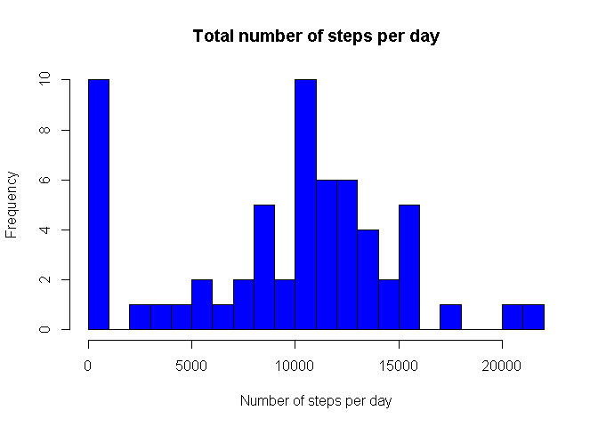
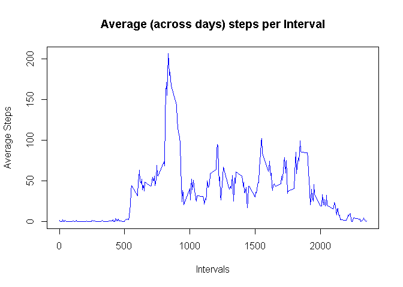
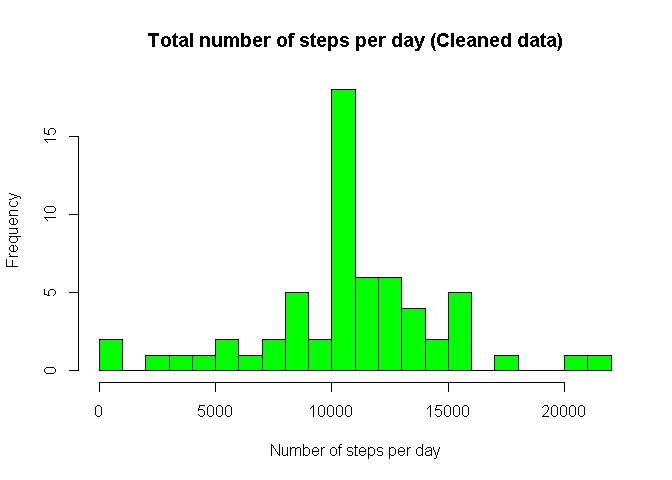
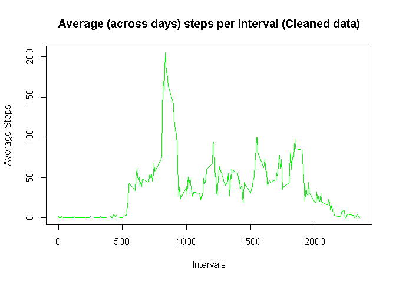
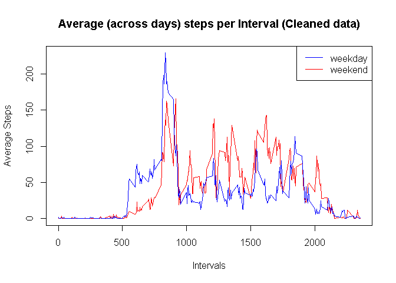

## Loading and preprocessing the data
 Load the "activity" data from the current directory. Also, convert the "date" column data in to correct data format (YYYY-MM-DD).
 
 
 ```r
 activity_data <- read.csv("activity.csv")
 activity_data$date <- as.Date(activity_data$date)
 str(activity_data)
 ```
 
 ```
 ## 'data.frame':	17568 obs. of  3 variables:
 ##  $ steps   : int  NA NA NA NA NA NA NA NA NA NA ...
 ##  $ date    : Date, format: "2012-10-01" "2012-10-01" ...
 ##  $ interval: int  0 5 10 15 20 25 30 35 40 45 ...
 ```

## What is mean total number of steps taken per day?

Following is the histogram of the total number of steps taken each day:


```r
steps_data <- with(activity_data, tapply(steps, date, sum, na.rm=TRUE))
hist(steps_data, ylab = "Frequency", xlab = "Number of steps per day", main = "Total number of steps per day", breaks = 20, col = "blue")
```

<!-- -->

And, the mean total number of steps taken per day:

```r
mean_steps <- mean(steps_data)
print(mean_steps)
```

```
## [1] 9354.23
```

Median of total number of steps per day:

```r
med_steps <- median(steps_data)
print(med_steps)
```

```
## [1] 10395
```
## What is the average daily activity pattern?

Now let's find the average daily activity pattern that is, a time-series plot with an interval of 5-minutes against average (across days) number of steps taken.


```r
avg_steps_days <- with(activity_data, tapply(steps, interval, mean, na.rm=TRUE))
interval_times <- unique(activity_data$interval)
plot(interval_times, avg_steps_days, type = "l",xlab = "Intervals",
     ylab = "Average Steps", col = "blue", main = "Average (across days) steps per Interval")
```

<!-- -->

The time interval having the maximum average steps taken:

```r
interval <- which(avg_steps_days == max(avg_steps_days, na.rm=TRUE))
print(interval_times[interval])
```

```
## [1] 835
```

## Imputing missing values

The total number of missing values and it's percentage:

```r
print(sum(is.na(activity_data$steps)))
```

```
## [1] 2304
```

```r
print(mean(is.na(activity_data$steps)))
```

```
## [1] 0.1311475
```

Now we replace the 'NA' with mean values of respective time-intervals:

```r
missing_indices <- which(is.na(activity_data$steps))
l <- length(avg_steps_days)
for (i in missing_indices) {
        activity_data[i,1] <- avg_steps_days[(i %% l)+1]
}
sum(is.na(activity_data$steps))
```

```
## [1] 0
```

```r
str(activity_data)
```

```
## 'data.frame':	17568 obs. of  3 variables:
##  $ steps   : num  0.3396 0.1321 0.1509 0.0755 2.0943 ...
##  $ date    : Date, format: "2012-10-01" "2012-10-01" ...
##  $ interval: int  0 5 10 15 20 25 30 35 40 45 ...
```

Activity plots with the new cleaned data:

```r
steps_data_new <- with(activity_data, tapply(steps, date, sum, na.rm=TRUE))
hist(steps_data_new, ylab = "Frequency", xlab = "Number of steps per day", main = "Total number of steps per day (Cleaned data)", breaks = 20, col = "green")
```

<!-- -->

```r
avg_steps_days_new <- with(activity_data, tapply(steps, interval, mean, na.rm=TRUE))
interval_times <- unique(activity_data$interval)
plot(interval_times, avg_steps_days_new, type = "l",xlab = "Intervals",
     ylab = "Average Steps", col = "green", main = "Average (across days) steps per Interval (Cleaned data)")
```

<!-- -->

Mean of new cleaned data:

```r
print(mean(steps_data_new))
```

```
## [1] 10766.19
```

## Are there differences in activity patterns between weekdays and weekends?

we make use of 'dplyr' package.


```r
library(dplyr)
```

```
## 
## Attaching package: 'dplyr'
```

```
## The following objects are masked from 'package:stats':
## 
##     filter, lag
```

```
## The following objects are masked from 'package:base':
## 
##     intersect, setdiff, setequal, union
```

Now, we add a column to dataset which filter whether the corresponding day/date happens to be a weekend.


```r
activity_data <- mutate(activity_data,  day = ifelse(weekdays(activity_data$date) == "Saturday" | weekdays(activity_data$date) == "Sunday", "weekend", "weekday"))
activity_data$day <- as.factor(activity_data$day)
str(activity_data)
```

```
## 'data.frame':	17568 obs. of  4 variables:
##  $ steps   : num  0.3396 0.1321 0.1509 0.0755 2.0943 ...
##  $ date    : Date, format: "2012-10-01" "2012-10-01" ...
##  $ interval: int  0 5 10 15 20 25 30 35 40 45 ...
##  $ day     : Factor w/ 2 levels "weekday","weekend": 1 1 1 1 1 1 1 1 1 1 ...
```

Following is the plot of differences in activities during weekends and weekdays:


```r
activity_weekend<-subset(activity_data,as.character(activity_data$day)=="weekend")
activity_weekday<-subset(activity_data,as.character(activity_data$day)=="weekday")

steps_weekend<-with(activity_weekend,tapply(steps,interval,mean,na.rm=TRUE))
steps_weekday<-with(activity_weekday,tapply(steps,interval,mean,na.rm=TRUE))

interval_times <- unique(activity_data$interval)

plot(interval_times, steps_weekend, type = "l",xlab = "Intervals",
     ylab = "Average Steps", col = "red", main = "Average (across days) steps per Interval (Cleaned data)", ylim = range(c(steps_weekend,steps_weekday)))
lines(interval_times,steps_weekday,col="blue")
legend("topright",legend=c("weekday", "weekend"), col = c("blue","red"), lty=c(1:1))
```

<!-- -->

Mean over the weekends:

```r
print(mean(steps_weekend, na.rm=TRUE))
```

```
## [1] 42.3664
```

Mean over the weekdays:

```r
print(mean(steps_weekday, na.rm=TRUE))
```

```
## [1] 35.61058
```
It can be observed that the work rate in terms of steps is more on weekends compared to weekdays.

